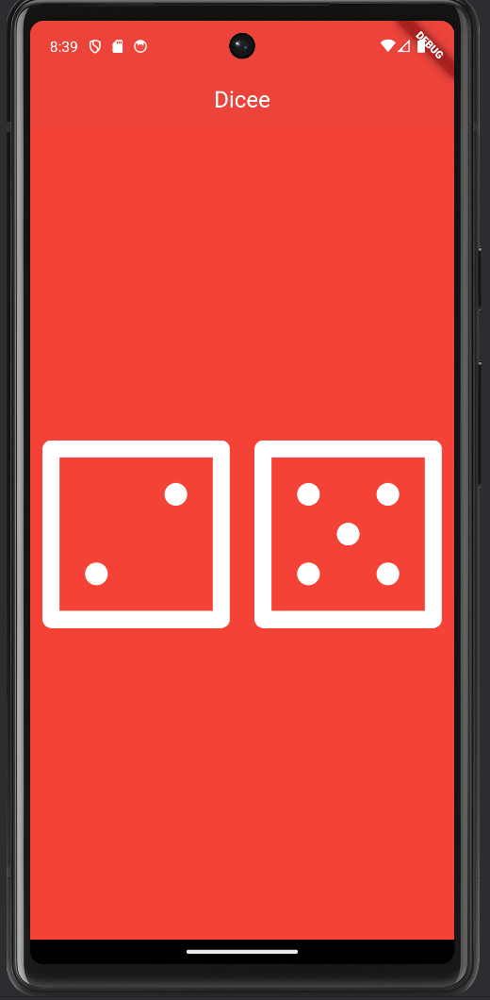

# Dicee - Flutter Dice App

Dicee is a simple Flutter application where two dice change their values when tapped. This app serves as a fun and interactive example of using Flutter to build mobile applications.

## Table of Contents

- [Project Description](#project-description)
- [Screenshots](#screenshots)
- [Features](#features)
- [Installation](#installation)
- [Usage](#usage)

## Project Description

Dicee is a Flutter-based mobile application that simulates rolling dice. When the user taps one of the dice, the dice change to show new random values. This project demonstrates the use of Flutter's `Random` classes, as well as basic state management with `StatefulWidget`.

This project is part of the Udemy course "The Complete Flutter Development Bootcamp with Dart" by Angela Yu.

## Screenshots



## Features

- Two dice that display random values between 1 and 6.
- Dice values change on tap.
- Simple and intuitive user interface.

## Installation

To run this project locally, follow these steps:

1. **Clone the repository:**

   ```bash
   git clone https://github.com/Eka1984/Dicee.git
   ```
   
2. **Navigate to the project directory:**

   ```bash
   cd dicee
   ```
   
3.  **Install dependencies:**

   ```bash
   flutter pub get
   ```

4. **Run the app:**

   ```bash
   flutter run
   ```  

## Usage

1. Open the app on your Android or iOS device/emulator.
2. Tap on one of the dice to roll the dice.
3. The dice will display new random values between 1 and 6.


